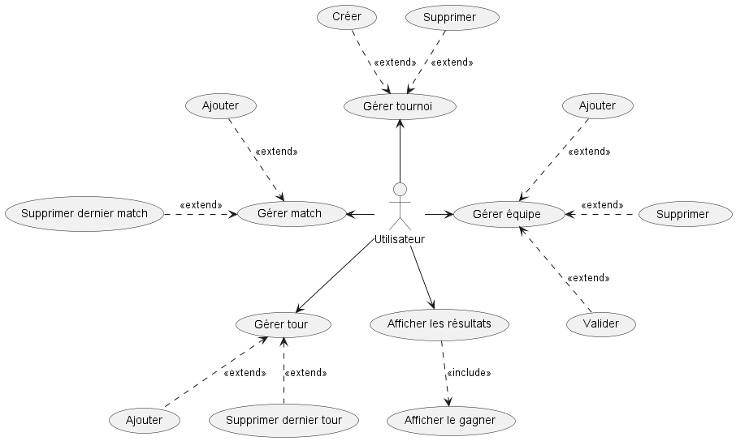
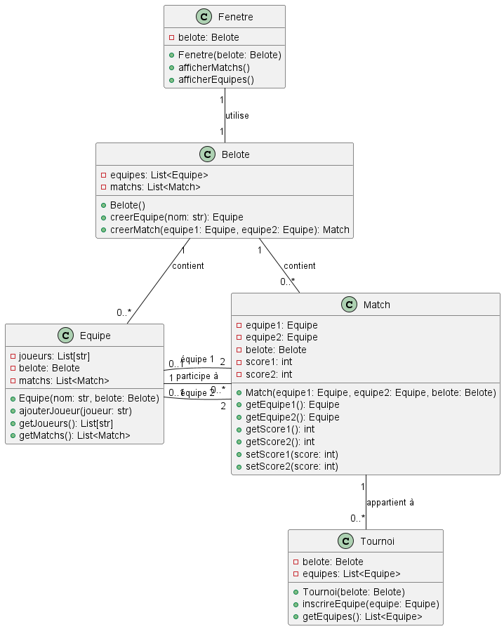

= Etape 1 : Analyse du code existant
Louis Yvelin / Anton Xu
2A - 20/03/2023
:toc: auto
:toc-title: Sommaire
:toclevels: 4
:title-separator: any
:source-highlighter: highlightjs
:nofooter:

toc::[]

<<<

== Présentation

Dans le cadre de cette SAE Refactoring, nous recevons le code source d'une application Java de gestion de tournois de Belote. +

Cette application dont l'interface utilisateur a été réalisée grâce à la bibliothèque Swing a pour but d'être refactoré par notre équipe pour l'améliorer en utilisant des patrons de conception ainsi que des bonnes pratiques de programmation.

== Cas d'utilisation

L'utilisateur a plusieurs actions qu'il peut réaliser :

- Gérer le tournoi
- Gérer l'équipe
- Gérer le tour
- Gérer le match
- Afficher les résultats

=== Diagramme des cas d'utilisation

== Classes

=== Diagramme de classes

=== Description des classes

==== Belote
Belote est la classe principale. Le code contient une classe interne Match qui stocke les informations sur chaque match joué dans le jeu.

Le programme se connecte à une base de données HSQLDB en utilisant JDBC et crée des champs en utilisant un fichier SQL. La classe Belote contient également une méthode importSQL pour importer les données SQL depuis un fichier dans la base de données.

Enfin, la classe crée une instance de la classe Fenetre pour afficher une interface utilisateur graphique pour le jeu de Belote. La méthode main de cette classe contient également des instructions pour fermer la connexion à la base de données.

==== Tournoi
Cette classe Java permet de modéliser un tournoi de belote. Elle utilise JDBC (Java Database Connectivity) pour accéder à une base de données et récupérer les informations sur le tournoi, les équipes et les matchs.

Cette classe est en charge de la quasi-totalité du fonctionnement interne de l'application avec la gestion de tournois, gestion d'équipes, gestion de tours, gestion de matchs et les requêtes à la base de données
// Attributs :
// statuttnom : une chaîne de caractères qui représente l'état actuel du tournoi (inscription des joueurs, génération des matchs, matchs en cours, terminé).
// nt : une chaîne de caractères qui représente le nom du tournoi.
// statut : un entier qui représente l'état actuel du tournoi sous forme numérique.
// id_tournoi : un entier qui représente l'identifiant du tournoi dans la base de données.
// dataeq : un vecteur d'objets Equipe qui contient toutes les équipes du tournoi.
// datam : un vecteur d'objets MatchM qui contient tous les matchs du tournoi.
// ideqs : un vecteur d'entiers qui contient les identifiants des équipes du tournoi.
// st : un objet Statement qui représente une requête SQL.
// Méthodes :
// Tournoi(String nt, Statement s) : un constructeur qui prend en paramètres le nom du tournoi et un objet Statement et qui initialise les attributs statut, id_tournoi, statuttnom et nt.
// majEquipes() : une méthode qui met à jour le vecteur dataeq avec toutes les équipes du tournoi.
// majMatch() : une méthode qui met à jour le vecteur datam avec tous les matchs du tournoi.
// getMatch(int index) : une méthode qui retourne l'objet MatchM correspondant à l'index donné.
// getNbMatchs() : une méthode qui retourne le nombre de matchs dans le tournoi.
// getEquipe(int index) : une méthode qui retourne l'objet Equipe correspondant à l'index donné.
// getNbEquipes() : une méthode qui retourne le nombre d'équipes dans le tournoi.
// getStatut() : une méthode qui retourne l'état du tournoi sous forme numérique.
// getNStatut() : une méthode qui retourne l'état du tournoi sous forme de chaîne de caractères.
// getNom() : une méthode qui retourne le nom du tournoi.
// getNbTours() : une méthode qui retourne le nombre de tours dans le tournoi.
// genererMatchs() : une méthode qui génère tous les matchs du tournoi.
// Haut du formulaire

// "deleteTournoi" permet de supprimer un tournoi à partir de son nom en supprimant d'abord tous les matchs et toutes les équipes associées à ce tournoi, puis le tournoi lui-même. Cette méthode prend en paramètre un objet de type Statement qui est utilisé pour exécuter les requêtes SQL. La méthode retourne un entier qui est toujours 0.
// "creerTournoi" permet de créer un nouveau tournoi en demandant à l'utilisateur de saisir le nom du tournoi. Cette méthode vérifie que le nom du tournoi n'est pas déjà utilisé et qu'il n'est pas trop court, puis elle l'ajoute à la base de données. Cette méthode prend également un objet de type Statement en paramètre pour exécuter les requêtes SQL et elle retourne un entier qui peut être 0 (si le tournoi a été créé avec succès) ou 1 ou 2 (si une erreur s'est produite pendant la création du tournoi).
// "ajouterEquipe" permet d'ajouter une nouvelle équipe au tournoi. Cette méthode calcule d'abord le numéro de l'équipe en fonction du nombre d'équipes déjà présentes dans le tournoi, puis elle ajoute l'équipe à la base de données en utilisant l'objet Statement. Elle appelle également la méthode "majEquipes" pour mettre à jour la liste des équipes.
// "majEquipe" permet de mettre à jour une équipe existante dans le tournoi. Cette méthode prend en paramètre l'index de l'équipe à mettre à jour et met à jour ses noms de joueur dans la base de données.
// "majMatch" permet de mettre à jour un match existant dans le tournoi. Cette méthode prend en paramètre l'index du match à mettre à jour et met à jour ses informations de score et de terminaison dans la base de données.
// "supprimerEquipe" permet de supprimer une équipe existante du tournoi. Cette méthode prend en paramètre l'identifiant de l'équipe à supprimer et supprime l'équipe correspondante de la base de données. Elle appelle également la méthode "majEquipes" pour mettre à jour la liste des équipes.

==== MatchM
Cette classe MatchM représente un match de belote. Elle contient les attributs suivants : +
"idmatch" : l'identifiant unique du match. +
"eq1" et "eq2" : les identifiants des deux équipes participant au match. +
"score1" et "score2" : les scores des deux équipes. +
"num_tour" : le numéro du tour actuel. +
"termine" : un booléen qui indique si le match est terminé ou non. +
Le constructeur prend en paramètre tous ces attributs et permet de créer un objet MatchM initialisé avec ces valeurs. +
La méthode "toString" permet de renvoyer une représentation en chaîne de caractères de l'objet MatchM, qui affiche les deux équipes qui s'affrontent dans le match.

==== Equipe
Cette classe Java est une représentation d'une équipe de Belote. Elle possède quatre attributs : l'identifiant unique de l'équipe, le numéro d'affichage, le nom du premier équipier et le nom du deuxième équipier. Le constructeur de la classe permet de créer une instance d'équipe en initialisant ces attributs. La visibilité des attributs est publique, ce qui permet de les accéder directement depuis d'autres classes, sans passer par des méthodes.

==== Fenetre
Cette classe Fenetre est la classe de l'interface graphique. Elle hérite de la classe JFrame et contient différents composants de l'interface utilisateur, tels que des boutons, des listes, des étiquettes, des panneaux et une table. La classe Fenetre dispose de plusieurs méthodes pour afficher différents panneaux selon les boutons cliqués et pour accéder à des données stockées dans une base de données. +
Plusieurs éléments de la GUI, tels que des boutons, des listes et des étiquettes, sont déclarés en tant que membres de la classe. +
Les boutons, lorsqu'ils sont cliqués, déclenchent des événements, qui appellent des méthodes spécifiques pour afficher les panneaux souhaités.

Cette classe est en charge de l'entièreté de l'affichage de l'application.
// En voici les principaux éléments :

// La méthode tracer_select_tournoi affiche une liste de tournois enregistrés dans une base de données, avec des boutons pour en créer un nouveau ou en supprimer un existant.

// La méthode tracer_details_tournoi affiche des détails sur le tournoi sélectionné, avec des champs de saisie pour modifier certains paramètres.

// La méthode tracer_tournoi_equipes affiche une liste des équipes participant au tournoi sélectionné, avec des boutons pour en ajouter ou en supprimer.

// La méthode tracer_tournoi_matchs affiche une liste des matchs joués dans le tournoi sélectionné, avec des informations sur les équipes participantes et les scores.

// La méthode tracer_tournoi_resultats affiche les résultats du tournoi sélectionné, avec les scores de chaque équipe et la position finale dans le classement.

// La classe utilise un CardLayout pour afficher dynamiquement les différents panneaux selon les boutons cliqués.

// La méthode eq_p crée un panneau qui contient un tableau d'équipes, ainsi que des boutons pour ajouter et supprimer des équipes. Elle utilise un objet TableEquipes pour afficher les équipes. Lorsque l'utilisateur clique sur le bouton de suppression, l'équipe sélectionnée est supprimée de la liste des équipes. Lorsque l'utilisateur clique sur le bouton de validation, les matchs sont générés et le tournoi peut commencer.

// La méthode tracer_tours_tournoi crée un panneau qui affiche les tours d'un tournoi, ainsi que des boutons pour ajouter et supprimer des tours. Elle utilise un objet JTable pour afficher les informations sur les tours. Lorsque l'utilisateur clique sur le bouton d'ajout, un nouveau tour est ajouté au tournoi. Lorsque l'utilisateur clique sur le bouton de suppression, le dernier tour est supprimé du tournoi.

== Analyse critique

Il y a plusieurs problèmes avec l'implémentation actuelle. 

Tout d'abord, il y a seulement cinq classes dont deux qui contiennent la grande majorité de l'application. Idéalement, il faudrait séparer chacune des parties de l'application en classes afin d'obtenir une architecture ordonnée ainsi que respecter le principe de responsabilité unique des classes (S de SOLID). 

Il y a une utilisation excessive de chaînes de caractères contenant des instructions SQL, qui sont ensuite exécutées à l'aide de l'interface JDBC. Cela peut poser des problèmes de sécurité si les chaînes de caractères sont mal formées ou si les entrées de l'utilisateur ne sont pas correctement validées. De plus, cela peut rendre le code difficile à maintenir et à déboguer. +
Ensuite, il y a une utilisation excessive de variables globales et de méthodes statiques, ce qui peut poser des problèmes de concurrence et rendre le code difficile à comprendre. Il y a des blocs de code qui sont entourés de clauses "try-catch" vides, masquant les erreurs et rendant le code difficile à déboguer (classe Fenetre). Enfin, il y a des noms de variables et de méthodes qui ne sont pas très descriptifs, ce qui peut rendre le code difficile à comprendre et à maintenir.

En résumé, bien que l'implémentation actuelle soit fonctionnelle, elle pourrait être améliorée en utilisant des pratiques de codage plus sûres et plus cohérentes afin que l'application devienne structurée, avec une architecture permettant sa maintenance et son extension.
